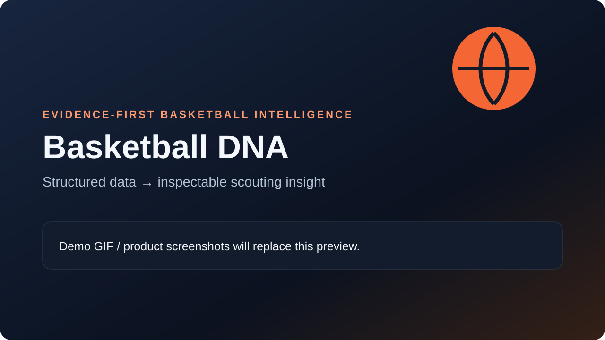
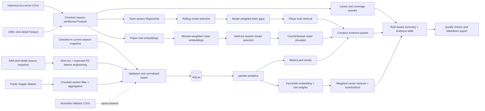

# BallDNA

> An explainable, self-supervised NBA player-style retrieval product built from historical box scores, shot profiles, and learned Player DNA embeddings.



BallDNA is a public portfolio project built to demonstrate practical machine-learning and data-engineering skills in one useful product. The ML pipeline is the product: feature engineering creates auditable player representations, self-supervised encoders learn persistent playing tendencies, and deterministic retrieval searches NBA history for comparable player-seasons.

> **Data note:** the default demo combines a checked-in derivative of [Eoin A Moore's NBA box-score dataset on Kaggle](https://www.kaggle.com/datasets/eoinamoore/historical-nba-data-and-player-box-scores), designated **CC0-1.0 / Public Domain** by its publisher, with engineered profiles from the [NBA Data Archive](https://huggingface.co/datasets/cdechoch/nba-data-archive), whose mirror declares **Apache-2.0**. Checked-in compact inference assets plus a larger local, Git-ignored Parquet archive cover team games from 1946-47, player games from 1951-52, and 6.3 million shot events from 1996-97 onward. A dated [nbarapm DARKO history snapshot](https://nbarapm.com/datasets/MetricHistory) supplies DPM context from 1996-97 onward; BallDNA ignores its historical team labels and joins only by NBA player ID and season. Coverage and provenance are stored alongside the data so an unavailable historical statistic is never treated as zero.

## Why I built it

AI, data science, and data engineering roles increasingly ask for proof that a candidate can turn ambiguous requirements into a working, explainable product. BallDNA combines API-ready ingestion boundaries, SQL storage, analytics, self-supervised representation learning, similarity search, evaluation, UI design, and graceful error handling in a recruiter-friendly prototype.

## What it demonstrates

- **Machine learning:** denoising autoencoders, temporal metric learning, learned embeddings, chronological holdouts, and baseline comparison.
- **Data engineering:** chunked CSV ingestion, season-partitioned Parquet, explicit coverage metadata, validation, idempotent SQLite loading, and indexed read paths.
- **Data science:** held-out temporal retrieval, statistical baselines, efficiency metrics, trend analysis, and explainable vector search.
- **Product engineering:** a multi-page Streamlit UI, interactive Plotly charts, clear limitations, deterministic evidence summaries, and Markdown export.
- **Software engineering:** a `src/` package layout, environment-based configuration, docstrings, unit/integration tests, and reproducible sample data.

## Product features

| Area | What the user can do | Evidence-first behavior |
|---|---|---|
| Player Scout | Find a player by name or team, inspect a profile, and create a rule-based summary | The fixed template cites stable evidence IDs shown in a table |
| Compare Players | Search or team-filter two players and compare their production profiles | Output explains fit for a stated need, not a universal winner |
| Similar Players | Switch between Broad History (common cross-era inputs) and Modern Detailed (2020+ action context), then filter candidates by season, age, position, or impact | Separate self-supervised Player DNA encoders are tested against cosine and PCA baselines; identity, team, position, size, efficiency, and impact are excluded from their inputs |
| Ask the Data | Try an under-construction keyword-based question router for a selected player | Unsupported causes are refused when context is missing |
| Team Needs Lab | Compare any team with a configurable top-5–10 benchmark and retrieve player examples for its largest gaps | Candidate robustness is measured across nine cohort/lookback definitions and capped by broad position |
| Roster Construction Lab | Add/remove players or assemble a custom roster | DARKO DPM estimates impact, custom per-36/shot embeddings describe fit, and a held-out-season model estimates team quality |
| Quality checks | Inspect model validation, data coverage, summary structure, citations, and numeric support | Tests verify the retrieval pipeline and deterministic summaries |
| Export | Download a report as Markdown | Export preserves citations and limitations |

Player discovery treats the selected team as a preference: if a name is not found on that team, BallDNA recommends matching players elsewhere and makes their team context explicit. Statistical cards, tables, chart series, and evidence follow the familiar relative order used by Basketball Reference; unavailable source fields are omitted and BallDNA-specific scores are placed last.

## Tech stack

Python 3.10+ · Streamlit · pandas · NumPy · SQLite · Plotly · scikit-learn · PyArrow · Kaggle CLI · python-dotenv · pytest

## Architecture



```text
app/                       Streamlit entry point, pages, and reusable UI components
src/ball_ai/data/          SQLite schema, read models, ingestion contract, sample loader
src/ball_ai/analytics/     Metrics, trends, role-aware retrieval, and shot-profile feature engineering
src/ball_ai/ai/            Evidence packets, deterministic summaries, quality checks
data/nba_snapshot/         Checked-in normalized CC0 snapshot and metadata
data/historical/           Checked-in inference assets plus a larger Git-ignored research archive
data/sample/               Illustrative second fallback and provenance note
scripts/                   Data ingestion, feature building, model training, and evaluation
tests/                     Unit and integration tests
```

## Data pipeline

1. The official Kaggle CLI downloads player, team, and biography CSVs from the public dataset.
2. pandas reads the large historical player file in chunks; each chunk is normalized and immediately written into season/type Parquet partitions.
3. Team game rows cover 1946-47 onward, player game rows cover 1951-52 onward in the current source version, and regular-season player aggregates are stored in a compact 25,000-row Parquet table.
4. The merged shot-detail Parquet file preserves 6.3 million raw shot events from 1996-97 onward and produces 14,511 player-season shot fingerprints.
5. `coverage.parquet` records the availability of player box scores, team box scores, and shot detail independently for every season and season type.
6. Early-era null fields stay null. The pipeline distinguishes all-zero DNP records from played games whose minutes are unavailable and handles the 2023 In-Season Tournament as regular-season data.
7. A separate compact snapshot keeps the interview demo fast and completely offline; SQLite still serves current scouting and comparison requests.
8. SQL and Parquet read models retrieve only the player and date windows each feature needs.
9. pandas functions add eFG%, true shooting, assist-to-turnover ratio, recent trend splits, and shot-style features.
10. Player DNA has two independently trained depths: Broad History excludes possession-action fields for consistent cross-era comparison, while Modern Detailed requires 2020+ action coverage. Offensive candidates span shot-detail history from 1996-97; matchup-based defense begins in 2017-18. Models train only through 2022-23, while later seasons remain validation and test data.

The current Player DNA model is frozen as `play-style-v1`: its parameters and
artifact hashes live in `models/play_style/v1/champion_manifest.json`. Compact
deployed artifacts are checked in, while raw partitions and training-only assets
remain in the Git-ignored historical archive. A rolling
backtest refits that fixed architecture before every adjacent-season retrieval
pair. Broad offense includes folds beginning in 1996-97, 2001-02, 2006-07,
2011-12, and 2016-17 in addition to the four recent folds; matchup-dependent
defense and overall use the four recent folds supported by their source data:

```bash
python scripts/evaluate_play_style_rolling.py
```

Offensive search adds an auditable sparse-action correction after the learned
embedding: 60% Player DNA similarity, 38% positive-behavior overlap, and 2%
information-weighted shared absence. The latter terms are a deterministic
reranker, not another AI model. A mutual absence receives less credit when it was
common in training, preventing ubiquitous zero hook or step-back rates from
dominating. The complete reranker is capped below 50% so the learned representation
remains primary. Eight fold-isolated chronological validation pairs selected the
40% reranker cap and reserved 5% of that allowance for shared absence. The
temporal challenger below tests whether a learned metric can safely reduce that
deterministic share.

The promoted temporal component uses Neighborhood Components Analysis as a compact
metric-learning encoder. Player identity is used only to define self-supervised
classes: repeated seasons from the same player are positives and every other
player-season is negative. Identity, name, team, position, size, efficiency, and
impact are not input features. Seven development folds selected a 30% temporal
ensemble weight. Across 19 holdout folds, it improved MRR from 0.593 to 0.612,
Top-1 retrieval from 47.3% to 49.1%, and Top-5 retrieval from 73.5% to 75.9%.
On eight trainable established rolling folds, it improved MRR from 0.623 to
0.643, Top-1 from 50.7% to 53.1%, and Top-5 from 76.0% to 77.8%. Reproduce the
experiment with:

```bash
python scripts/train_temporal_contrastive_encoder.py
```

The deployed Broad History offensive score is 42% denoising Player DNA, 30%
temporal metric similarity, 26.6% positive-behavior overlap, and 1.4%
information-weighted shared absence. The original 60% / 38% / 2% hybrid and its
artifact hashes remain frozen as the rollback configuration.

The command writes the complete local evidence beside the frozen artifacts and a
compact, reviewable summary to
`models/play_style/temporal_contrastive_v1_summary.json`, including per-fold
results and both deployment and rollback weights.

The first Broad History v2 challenger adds stable 1996+ distance bands, corner
and above-the-break three frequency, paint zones, lateral location mix, and shot
dispersion. Detailed move labels are excluded from its stable-only variant because
their source taxonomy changes by era. Run its absolute, era-relative, feature-weight,
and training-budget comparison with:

```bash
python scripts/train_broad_v2_candidate.py --rebuild-features
```

The winning candidate keeps the champion features and adds the new location group
at 0.25 weight. Across nine folds it improves Recall@5 from 71.2% to 75.0% and MRR
from 0.580 to 0.618. The weight is selected on the first eight folds; the untouched
2025-26 → 2024-25 fold improves from 75.0% to 78.6% Recall@5. The live app remains
on v1 until qualitative player comparisons and human review also pass.

The challenger also has a separate robustness harness:

```bash
python scripts/evaluate_broad_v2_robustness.py
```

It rebuilds features from independent first- and second-half samples across eight
seasons from 1997-98 through 2025-26, bootstraps complete player-games 20 times,
predicts six deliberately hidden behaviors, and retrains feature-group ablations to
look for identity shortcuts. Split-season Recall@5 is **82.2%** with **0.691 MRR**,
ahead of the cosine baseline's 81.0% and 0.676. Bootstrap embeddings average 0.981
cosine similarity, while the exact top-10 lists average 0.530 Jaccard overlap; this
improves from 0.476 for 100-199 attempts to 0.595 above 800 attempts. The learned
space beats a fold-specific mean on every hidden behavior and beats the raw cosine
baseline on four of six. Player identity, name, team, position, height, and weight
remain excluded. Lateral location alone has only 4.99% split-season Recall@1, so it
adds signal without dominating the full representation. Complete reproducible
results live in `models/play_style/broad_v2_robustness_summary.json`.
11. Validation and untouched future-season tests ask whether a player retrieves their own adjacent season; cosine and PCA implementations provide non-neural baselines.
12. Style Twin ranks behavioral proximity alone. Comparable Player applies a lens-specific DARKO DPM band after retrieval, without leaking impact into the embedding.
13. Standardized input gaps explain why each neighbor was retrieved, while efficiency and impact differences remain visible as non-ranking context.
14. The evidence layer selects a compact, serializable packet with source status and limitations for auditable UI summaries.

### Team Needs Lab

The team pipeline pairs both sides of every regular-season game and calculates estimated possessions, Offensive Rating, Defensive Rating, Net Rating, effective FG%, opponent eFG%, turnover and forced-turnover rates, offensive and defensive rebound rates, free-throw rate, three-point attempt rate, assist ratio, pace, stocks per 100 possessions, and paint/transition/second-chance/bench scoring shares. These definitions follow the possession-adjusted concepts in the [NBA Stats glossary](https://www.nba.com/stats/help/glossary).

Three classifiers were compared with rolling future-season validation on 2022-23, 2023-24, and 2024-25. Explainable logistic regression was selected over random forest and gradient boosting because it achieved the best combination of **0.947 ROC-AUC**, **0.900 average precision**, and **75% precision in its predicted top eight**. The model's coefficients weight standardized team gaps; a deterministic mapping then converts those gaps into player traits and ranks candidates by league-percentile alignment and sample reliability.

The result is deliberately described as an **elite-profile association**, not a causal forecast. Candidate examples do not imply availability, affordability, health, or trade realism. Each player list is a consensus across nine top-team/lookback definitions and is capped at three examples per broad position; this keeps parameter-sensitive and center-heavy rankings visible without allowing either to dominate the output. Individual defense uses steals, blocks, and defensive rebounding as limited proxies because matchup assignments and tracking are unavailable.

Rebuild the small derived assets after refreshing historical data:

```bash
python scripts/build_team_needs_assets.py
```

### Roster Construction Lab

The roster pipeline creates 13-dimensional player vectors for scoring volume,
efficiency, perimeter volume and accuracy, rim pressure, shot creation,
playmaking, ball security, offensive and defensive rebounding, disruption, rim
protection, and interior scoring. Percentages are empirically shrunk toward the
season mean before conversion to within-season percentiles, reducing small-sample
noise.

Team embeddings are not simple player sums. Player quality and player style are
separate. Public **DARKO DPM** is the primary player-impact rate; a documented
box-score composite is used only when a player-season is absent from the snapshot.
The 13 custom traits remain responsible for style, role fit, and team identity.
Counting production is converted to per-36 rates, so minutes are never treated as
player ability. The model then adds top-three quality, effective rotation size, minute
concentration, positional shares, positional entropy, and two-way balance. The
user can remove or add players or build an empty custom roster; there is no manual
minutes editor. The UI preserves each player's actual observed MPG. Historical and
reference rosters use every player's share of the minutes actually contributed;
the UI expresses that share as a 240-minute equivalent without deleting bench roles.
Reference rosters use each player's latest team stint in that season, so traded
players appear only on the team they finished the season with.
An addition can earn up to his observed MPG, but only by replacing lower-
impact roles at overlapping positions; minutes opened by removals are filled first.
Newcomers are allocated strongest-first, making the result independent of click
order. A marginal addition to an elite rotation can therefore receive zero minutes
and zero wins rather than creating value merely because he was added.
This avoids the earlier failure where adding a guard proportionally diluted every
player—including the frontcourt. Frontcourt and interior chart labels are also
calculated from forwards and centers rather than the entire roster.

The current archive supplies 150 usable team-seasons from 2021-22 through 2025-26.
The CC0 mirror's missing 2021-22 player-team field is repaired by exact player/game
matching against the official NBA LeagueGameLog endpoint; all 25,826 stored rows
matched, and the source is recorded in archive metadata. Leave-one-season-out
validation compared Elastic Net, Ridge, random
forest, gradient boosting, and a season-mean baseline. Elastic Net was selected
with **1.79 Net Rating MAE**, **2.27 RMSE**, and **0.89 rank correlation**, versus
**4.31 MAE** for the baseline.

For historically supported rosters, the primary output is estimated Net Rating.
A transparent calibration maps that estimate to an 82-game win midpoint, while
the displayed range uses the 80th percentile absolute error from held-out
seasons. Before displaying either number, an extrapolation guard measures the
roster's standardized distance from its nearest historical team and compares it
with the 95th percentile of leave-one-out historical neighbour distances.

If a custom roster is outside that empirical boundary—such as a lineup made
almost entirely of high-usage stars—BallDNA hides the cross-sectional association
model rather than presenting an unsupported regression extrapolation. The sandbox
still displays experimental expected wins, team identity, a rotation/top-three
talent index, and clearly labeled historical analogues.
This distinction matters because the archive contains real rosters, not examples
where many primary creators all retain their previous usage simultaneously. The
UI respects the support decision and never reconstructs or displays withheld
estimates.

The page leads edited rosters with **experimental expected wins** and supporting
Net Rating. A non-negative talent-only model maps a fixed 65% rotation-quality and
35% top-three-quality index to an optimistic 82-game point estimate. The change is anchored to the
team's real record, then a bounded logistic calibration converts Net Rating to wins.
That calibration achieved **2.25-win leave-one-season-out MAE**, versus **2.35**
for the old linear mapping, and introduces diminishing returns near elite records.
The UI states that historical transactions have not yet calibrated this output as
a real forecast. The lower-error
same-season association model remains available as a diagnostic rather than being
misrepresented as the causal effect of a player addition.

Every addition also receives an allocation explanation. The page names the
incumbents whose minutes were displaced or the higher-impact overlapping players
who blocked the addition. A user can explicitly **force the player into the
rotation**, which transfers those minutes anyway and makes a negative roster result
observable. Forced minutes are labeled as a user assumption and can be reverted.

Player selection uses a strict typeahead: literal fragments narrow the visible
dropdown, while a submitted one- or two-character typo is resolved with a bounded
edit-distance check. A selected source team restricts results to that roster and
can be cleared with the native × control. Additions appear before removals in the
editor, and both queues can be changed one player at a time. The data layer retains
every player with recorded minutes, but roster-simulation additions require at
least five games; one-to-four-game players remain available for scouting with low
reliability rather than disappearing from the database.

The UI includes a validation-scope table that distinguishes held-out accuracy,
software invariants, constrained behavior, and still-unvalidated transaction
effects. The chronological evaluation design is documented in
[`docs/COUNTERFACTUAL_VALIDATION.md`](docs/COUNTERFACTUAL_VALIDATION.md).

The result panel also separates **actual wins** from **Net Rating-implied wins**.
The latter applies the validated bounded calibration to the team's actual season
Net Rating; actual minus implied is a retrospective over/under-performance signal,
not a prediction made before the season.

Learned linear models shrink unusually strong or weak teams toward the league
average. For edits that begin with an observed team, the simulator therefore
residual-anchors the scenario to that team's actual Net Rating and win pace and
applies only the model-estimated roster change. No-change scenarios reproduce the
known baseline. From-scratch rosters have no observed baseline and display the raw
model estimate only when the empirical support check passes.

The raw model can produce tiny signed differences that are far below its validated
resolution. Until counterfactual deltas can be backtested directly, changes smaller
than the held-out Net Rating MAE are labeled **no detectable change**. BallDNA does
not interpret a −0.1 estimate as evidence that the removed player was better.

Build or refresh these assets with:

```bash
python scripts/build_roster_construction_assets.py
```

This is intentionally a **same-season descriptive counterfactual**, not a causal
trade model or preseason forecast. Better future versions would use prior-season
inputs, availability projections, lineup/on-off impact, matchup and tracking data,
contract constraints, and nested time-aware hyperparameter tuning.

### Similarity and shot-style embeddings

The active 22-feature player vector covers production, shooting percentages, creation, rebounding, box-score defensive proxies, shot zones, action types, average distance, modeled difficulty, and shot making versus expectation. Role presets such as **Spacing wing**, **Primary creator**, and **Interior impact** change feature importance without pretending to measure overall player quality.

`shot_profile.py` classifies rim, paint, midrange, three-point, dunk, layup, floater, hook, pull-up, and step-back frequencies. It estimates a smoothed expected FG% from league-wide zone/action buckets, producing a transparent shot-difficulty proxy and shot-making-above-expected feature. This is not a direct defender-pressure model, and the UI states that limitation.

Refresh the real snapshot and SQLite database:

```bash
python scripts/sync_nba_data.py --season 2025-26
python scripts/sync_shot_data.py --season 2025-26
python scripts/sync_historical_data.py
```

When the full local archive already exists, rebuild the compact app snapshot
without another download using `python scripts/rebuild_current_snapshot_from_archive.py`.
Both paths retain one-game players; downstream reliability and sample shrinkage,
not silent ingestion filters, control how strongly their statistics are interpreted.

The historical command builds `data/historical/` with Snappy-compressed Parquet and removes temporary CSV downloads after successful conversion. Re-running it is resumable at the download stage; `--raw-dir` and `--shots-parquet` accept existing source files, while `--keep-downloads` retains downloaded originals for debugging. Raw event partitions and training-only artifacts remain excluded from Git; compact inference artifacts are checked in so the app still runs without network access.

## How deterministic summaries stay evidence-linked

`build_player_evidence` produces:

- player and season metadata;
- selected season metrics;
- compact prior-season context retrieved from the historical Parquet archive;
- aggregates over the available recent-game sample;
- calculated recent-vs-prior trends;
- evidence IDs and provenance;
- explicit product limitations.

The rule-based renderer reads only this packet, fills fixed report sections, cites stable evidence IDs, and refuses unsupported question types. It does not browse, infer hidden context, or alter model rankings. The UI renders the same packet as a copyable evidence table.

For Team Needs Lab and Roster Construction Lab, fixed numeric models complete all rankings and estimates before the template runs. The template only formats commonalities, gaps, candidates, validation results, and limitations.

### Example output

```markdown
## Summary
The player's supplied profile is led by season scoring production at 28.7 points
per game [E1]. This is a data-only reading of the stored snapshot.

## Weaknesses or risks
Ball security is a monitoring point at 2.4 turnovers per game [E6]. The packet
does not include usage or time-of-possession, so the cause cannot be isolated.
```

## Run locally

```bash
git clone <your-repository-url>
cd <repository-directory>
python3 -m venv .venv
source .venv/bin/activate          # Windows: .venv\Scripts\activate
python -m pip install -r requirements.txt
cp .env.example .env
python scripts/init_db.py
streamlit run app/main.py
```

Open the local URL Streamlit prints. `.env` is optional and only overrides local data and database paths; the app runs locally without external model services.

## Tests and product quality checks

```bash
pytest
python scripts/evaluate_reports.py
```

The suite covers metric calculations, zero denominators, Player DNA eligibility, shortcut exclusion, temporal self-retrieval, impact-banded comparison, historical team/opponent pairing, possession-adjusted ratings, player-fit retrieval, SQL loading, evidence citations, numeric support, and deterministic summary behavior.

## Limitations

- The default licensed dataset is a point-in-time snapshot and can become stale.
- Player-level box scores in the selected source begin in 1951-52; team-level rows provide league coverage back to 1946-47.
- Shot coordinates and action labels begin in 1996-97. Earlier seasons expose only the box-score fields actually recorded by the source.
- Team ratings are locally estimated from box-score possessions and can differ slightly from NBA.com's official possession calculations.
- Team Needs Lab finds associations between statistical profiles and top-eight finishes; it does not establish that a recommended roster move would cause additional wins.
- Roster Construction Lab uses same-season player performance to estimate the team quality associated with a hypothetical profile; adding a player does not establish that the real transaction would cause the displayed change.
- The roster model infers contribution weights from observed MPG and games played; it does not yet predict future injuries, missed games, coaching decisions, chemistry, or nonlinear lineup interactions.
- Player recommendations do not include salary, contracts, availability, trade rules, injury status, or chemistry.
- The CC0 designation is made by the Kaggle publisher. BallDNA records the publisher's license and upstream attribution but does not independently warrant rights in upstream material.
- Names, positions, and historical rows can contain source-data gaps or normalization differences.
- Shot detail captures selection and action labels but omits direct defender distance, ball/player tracking, lineup combinations, opponent strength, injuries, contracts, and defensive assignments.
- Player DNA describes proximity within observable public statistics, not an objectively correct scouting comparison. Defensive retrieval remains lower-confidence because public events do not fully observe scheme, positioning, communication, or off-ball decisions.
- Citation and numeric checks are useful heuristics, not full semantic factuality verification.

**This project is not intended to predict the future or replace expert scouting. It demonstrates how structured data, self-supervised learning, retrieval, and transparent evaluation can be combined to create explainable decision support.**

## Future improvements

1. Scheduled Kaggle snapshot refresh with integrity checks and freshness alerts.
2. Evaluate retrieval quality with expert-labeled comparison pairs and learn optional feature weights.
3. Train and compare stronger temporal and contrastive encoders with additional behavior features.
4. Shot chart and play-type data when a suitable source is available.
5. Team-fit recommendations using lineup/on-off impact, projected availability, nonlinear player interactions, and roster constraints.
6. Calibrate similarity bands and reliability against expert-reviewed comparison sets.
7. Docker packaging and a lightweight deployment pipeline.
8. Automated model-registry promotion and reproducible scheduled retraining.

## Recruiter-relevant keywords

Python, SQL, SQLite, pandas, NumPy, Streamlit, Plotly, scikit-learn, ETL, data validation, feature engineering, self-supervised learning, denoising autoencoders, metric learning, vector embeddings, cosine similarity, nearest-neighbor retrieval, chronological holdouts, MRR, Recall@K, explainable AI, model evaluation, pytest, Git, Parquet, environment variables, error handling, analytics, visualization, product thinking, software architecture.
